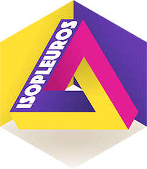

<!-- README.md is generated from README.Rmd. Please edit that file -->

```{r, include = FALSE}
knitr::opts_chunk$set(
  collapse = TRUE,
  comment = "#>",
  fig.path = "man/figures/README-",
  out.width = NULL
)
Sys.setenv(LANGUAGE = "en") # Force locale
```

# isopleuros 

<!-- badges: start -->
[](https://cran.r-project.org/package=isopleuros)

[](https://tesselle.r-universe.dev/isopleuros){.pkgdown-devel}
[](https://cran.r-project.org/package=isopleuros){.pkgdown-release}
[](https://cran.r-project.org/web/checks/check_results_isopleuros.html){.pkgdown-release}
[](https://cran.r-project.org/package=isopleuros){.pkgdown-release}

[](https://www.repostatus.org/#active)

[](https://doi.org/10.5281/zenodo.7940389)
<!-- badges: end -->

## Overview

Ternary plots made simple. **isopleuros** allows to create ternary plots using base **graphics**. It provides functions to display the data in the ternary space, to add or tune graphical elements and to display statistical summaries. It also includes common ternary diagrams useful for the archaeologist (e.g. soil texture charts, ceramic phase diagram).

**isopleuros** is a dependency-free package^[The only exception is the `ternary_contour()` function for which the [**interp**](https://cran.r-project.org/package=interp) package is required, but is not installed by default.] designed to be as simple as possible. If you need finer tuning or more advanced features, you should consider the [**Ternary**](https://ms609.github.io/Ternary/) or [**ggtern**](http://www.ggtern.com/) package.

---

```{r citation, echo=FALSE, comment='', results='asis'}
cite <- utils::citation("isopleuros")
print(cite, bibtex = FALSE)
```

## Installation

You can install the released version of **isopleuros** from [CRAN](https://CRAN.R-project.org) with:

```{r cran-installation, eval=FALSE}
install.packages("isopleuros")
```

And the development version from [Codeberg](https://codeberg.org/) with:

```{r gh-installation, eval=FALSE}
# install.packages("remotes")
remotes::install_git("https://codeberg.org/tesselle/isopleuros")
```

## Usage

```{r packages-load}
## Load package
library(isopleuros)
```

```{r ternary, fig.width=7, fig.height=3.5, fig.align='center'}
## Graphical parameters
par(mfrow = c(1, 2), mar = c(0, 0, 0, 0) + 0.1)

## Set colors
col <- c("blue", "red")

## Ternary plot
## (data from Aitchison 1986)
ternary_plot(
  x = lava, 
  panel.first = ternary_grid(),
  col = col[as.factor(lava$A > 30)],
)

## Split data
groups <- split(lava, f = lava$A > 30)

## Add tolerance ellipses
for (i in seq_along(groups)) {
  ternary_tolerance(groups[[i]], level = 0.975, lty = 2, border = col[[i]])
}

## Density contours
ternary_plot(lava, panel.first = ternary_grid())
ternary_density(lava, n = 500, nlevels = 10)
```

```{r pairs, fig.width=7, fig.height=7, fig.align='center'}
## Install extra package (if needed)
# install.packages("folio")

## Data from Barrera and Velde 1989
data("verre", package = "folio")

## Select data
coda <- verre[, c("Na2O", "CaO", "K2O", "MgO", "P2O5", "Al2O3")]

## Ternary plots with marginal compositions
ternary_pairs(coda, col = as.factor(coda$Na2O > 5))
```

```{r charts, fig.width=7, fig.height=7, fig.align='center'}
## Graphical parameters
par(mfrow = c(2, 2), mar = c(0, 0, 0, 0) + 0.1)

## Ceramic phase diagram
ternary_plot(NULL, axes = FALSE, ann = FALSE, frame.plot = TRUE)
triangle_phase_cas(symbol = TRUE, pch = 16)

ternary_plot(NULL, xlab = "CaO", ylab = "Al2O3", zlab = "SiO2")
triangle_phase_ceramic(symbol = TRUE, pch = 16)

## HYPRES soil texture
ternary_plot(NULL, xlab = "sand", ylab = "silt", zlab = "clay")
triangle_soil_hypres()

## USDA (1951) soil texture
ternary_plot(NULL, xlab = "sand", ylab = "silt", zlab = "clay")
triangle_soil_usda(symbol = TRUE)
```

## Contributing

Please note that the **isopleuros** project is released with a [Contributor Code of Conduct](https://www.tesselle.org/conduct.html). By contributing to this project, you agree to abide by its terms.

```{r metadata, include=FALSE}
## Update codemeta.json
codemetar::write_codemeta(verbose = FALSE)

## Update CITATION.cff
cff_keys <- list(
  identifiers = list(
    list(description = "The concept DOI.",
         type = "doi",
         value = "10.5281/zenodo.7940389"),
    list(description = "The versioned DOI for version 1.0.0.",
         type = "doi",
         value = "10.5281/zenodo.7940390"),
    list(description = "The versioned DOI for version 1.1.0.",
         type = "doi",
         value = "10.5281/zenodo.10357139"),
    list(description = "The versioned DOI for version 1.2.0.",
         type = "doi",
         value = "10.5281/zenodo.10469854"),
    list(description = "The versioned DOI for version 1.3.0.",
         type = "doi",
         value = "10.5281/zenodo.14204958"),
    list(description = "The CRAN DOI",
         type = "doi",
         value = "10.32614/cran.package.isopleuros")
  )
)
cff <- cffr::cff_create("DESCRIPTION", keys = cff_keys)
if (cffr::cff_validate(cff)) cffr::cff_write(cff, outfile = "CITATION.cff")
```
