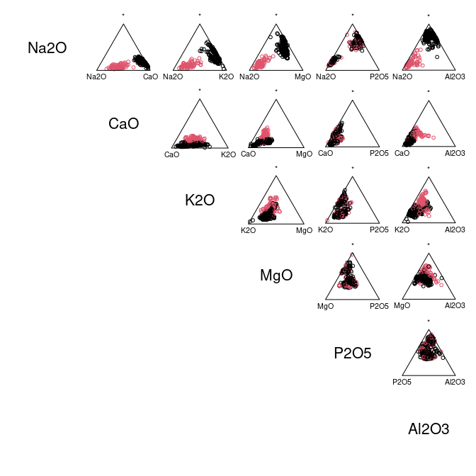

<!-- README.md is generated from README.Rmd. Please edit that file -->

# isopleuros

<!-- badges: start -->

[](https://github.com/tesselle/isopleuros/actions)
[](https://app.codecov.io/gh/tesselle/isopleuros)
[](https://www.codefactor.io/repository/github/tesselle/isopleuros/overview/main)

[](https://www.repostatus.org/#wip)
<!-- badges: end -->

## Overview

Ternary plots made simple. **isopleuros** allows to create ternary plot
using **graphics**. It provides functions to display the data in the
ternary space, to add or tune graphical elements and to display
statistical summaries. It also includes common ternary diagrams useful
for the archaeologist (e.g. soil texture charts, ceramic phase diagram).

**isopleuros** is a dependency-free package designed to be as simple as
possible. If you need finer tuning or more advanced features, you should
consider the [**Ternary**](https://ms609.github.io/Ternary/) or
[**ggtern**](http://www.ggtern.com/) package.

## Installation

You can install the released version of **isopleuros** from
[CRAN](https://CRAN.R-project.org) with:

``` r
install.packages("isopleuros")
```

And the development version from [GitHub](https://github.com/) with:

``` r
# install.packages("remotes")
remotes::install_github("tesselle/isopleuros")
```

## Usage

``` r
## Load package
library(isopleuros)
```

**isopleuros** tries to mimic the way **graphics** works as much as
possible.

``` r
## Install extra package (if needed)
# install.packages("folio")

## Data from Barrera and Velde 1989
data("verre", package = "folio")

## Select data
coda <- verre[, c("Na2O", "CaO", "K2O")]

## Ternary plot
ternary_plot(coda, panel.first = ternary_grid())

## Split data
groups <- split(coda, f = coda$Na2O > 5)

## Add tolerance ellipses
for (group in groups) {
  ternary_tolerance(group, level = 0.975, border = "blue", lty = 2)
}
```


``` r
## Select data
coda <- verre[, c("Na2O", "CaO", "K2O", "MgO", "P2O5", "Al2O3")]

## Ternary plots with marginal compositions
ternary_pairs(coda, col = as.factor(coda$Na2O > 5))
```



``` r
par(mfrow = c(2, 2), mar = c(0, 0, 0, 0) + 0.1)

## Ceramic phase diagram
ternary_plot(NULL, axes = FALSE, ann = FALSE, frame.plot = TRUE)
triangle_phase_cas(symbol = TRUE, pch = 16)

ternary_plot(NULL, xlab = "CaO", ylab = "Al2O3", zlab = "SiO2")
triangle_phase_ceramic(symbol = TRUE, pch = 16)

## HYPRES soil texture
ternary_plot(NULL, xlab = "sand", ylab = "silt", zlab = "clay")
triangle_soil_hypres()

## USDA (1951) soil texture
ternary_plot(NULL, xlab = "sand", ylab = "silt", zlab = "clay")
triangle_soil_usda(symbol = TRUE)
```


## Contributing

Please note that the **isopleuros** project is released with a
[Contributor Code of Conduct](https://www.tesselle.org/conduct.html). By
contributing to this project, you agree to abide by its terms.
