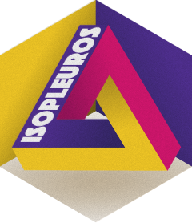

<!-- README.md is generated from README.Rmd. Please edit that file -->

# isopleuros 

<!-- badges: start -->

[](https://cran.r-project.org/package=isopleuros)

<a href="https://tesselle.r-universe.dev/isopleuros"
class="pkgdown-devel"></a>
<a href="https://cran.r-project.org/package=isopleuros"
class="pkgdown-release"></a> <a
href="https://cran.r-project.org/web/checks/check_results_isopleuros.html"
class="pkgdown-release"></a>
<a href="https://cran.r-project.org/package=isopleuros"
class="pkgdown-release"></a>

[](https://www.repostatus.org/#active)

[](https://doi.org/10.5281/zenodo.7940389)
<!-- badges: end -->

## Overview

Ternary plots made simple. **isopleuros** allows to create ternary plots
using base **graphics**. It provides functions to display the data in
the ternary space, to add or tune graphical elements and to display
statistical summaries. It also includes common ternary diagrams useful
for the archaeologist (e.g. soil texture charts, ceramic phase diagram).

**isopleuros** is a dependency-free package[^1] designed to be as simple
as possible. If you need finer tuning or more advanced features, you
should consider the [**Ternary**](https://ms609.github.io/Ternary/) or
[**ggtern**](http://www.ggtern.com/) package.

------------------------------------------------------------------------

To cite isopleuros in publications use:

Frerebeau N (2024). *isopleuros: Ternary Plots*. Université Bordeaux
Montaigne, Pessac, France. <doi:10.5281/zenodo.7940389>
<https://doi.org/10.5281/zenodo.7940389>, R package version 1.3.0,
<https://packages.tesselle.org/isopleuros/>.

This package is a part of the tesselle project
<https://www.tesselle.org>.

## Installation

You can install the released version of **isopleuros** from
[CRAN](https://CRAN.R-project.org) with:

``` r
install.packages("isopleuros")
```

And the development version from [Codeberg](https://codeberg.org/) with:

``` r
# install.packages("remotes")
remotes::install_git("https://codeberg.org/tesselle/isopleuros")
```

## Usage

``` r
## Load package
library(isopleuros)
```

``` r
## Graphical parameters
par(mfrow = c(1, 2), mar = c(0, 0, 0, 0) + 0.1)

## Set colors
col <- c("blue", "red")

## Ternary plot
## (data from Aitchison 1986)
ternary_plot(
  x = lava, 
  panel.first = ternary_grid(),
  col = col[as.factor(lava$A > 30)],
)

## Split data
groups <- split(lava, f = lava$A > 30)

## Add tolerance ellipses
for (i in seq_along(groups)) {
  ternary_tolerance(groups[[i]], level = 0.975, lty = 2, border = col[[i]])
}

## Density contours
ternary_plot(lava, panel.first = ternary_grid())
ternary_density(lava, n = 500, nlevels = 10)
```


``` r
## Install extra package (if needed)
# install.packages("folio")

## Data from Barrera and Velde 1989
data("verre", package = "folio")

## Select data
coda <- verre[, c("Na2O", "CaO", "K2O", "MgO", "P2O5", "Al2O3")]

## Ternary plots with marginal compositions
ternary_pairs(coda, col = as.factor(coda$Na2O > 5))
```


``` r
## Graphical parameters
par(mfrow = c(2, 2), mar = c(0, 0, 0, 0) + 0.1)

## Ceramic phase diagram
ternary_plot(NULL, axes = FALSE, ann = FALSE, frame.plot = TRUE)
triangle_phase_cas(symbol = TRUE, pch = 16)

ternary_plot(NULL, xlab = "CaO", ylab = "Al2O3", zlab = "SiO2")
triangle_phase_ceramic(symbol = TRUE, pch = 16)

## HYPRES soil texture
ternary_plot(NULL, xlab = "sand", ylab = "silt", zlab = "clay")
triangle_soil_hypres()

## USDA (1951) soil texture
ternary_plot(NULL, xlab = "sand", ylab = "silt", zlab = "clay")
triangle_soil_usda(symbol = TRUE)
```


## Contributing

Please note that the **isopleuros** project is released with a
[Contributor Code of Conduct](https://www.tesselle.org/conduct.html). By
contributing to this project, you agree to abide by its terms.

[^1]: The only exception is the `ternary_contour()` function for which
    the [**interp**](https://cran.r-project.org/package=interp) package
    is required, but is not installed by default.
